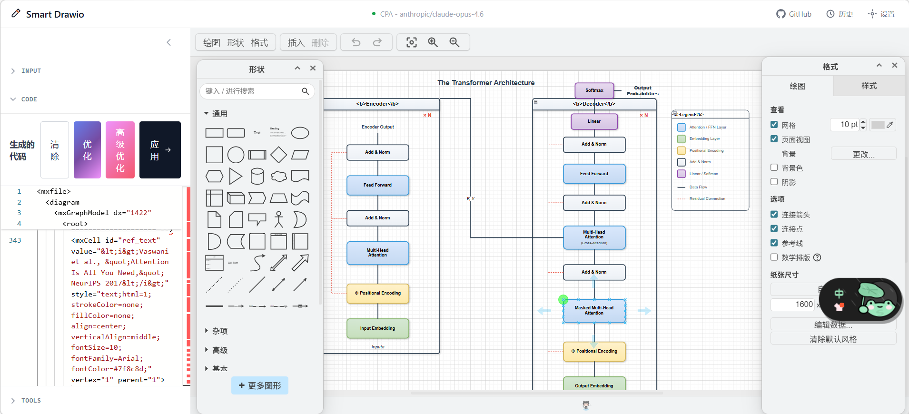

# Smart Drawio Next

[中文文档](./README.md)

> Generate editable Draw.io diagrams from natural language or reference images in seconds, optimized for research, documentation, and presentations.

## Live Demo

- Demo: <https://smart-drawio-next.vercel.app/>
- Note: the hosted version requires your own API key

## Screenshots

| Home | Transformer |
|------|-------------|
|  |  |

| Swin-Transformer | CLIP |
|------------------|------|
|  |  |

| ProSST |
|--------|
|  |

## Overview

[smart-drawio-next](https://github.com/yunshenwuchuxun/smart-drawio-next) is a diagram generation tool built with Next.js 16, embedded Draw.io, and streaming LLM APIs. It helps you:

- Generate structured diagrams from natural language prompts
- Upload reference images and convert them into editable diagram content
- Fine-tune XML / JSON in Monaco Editor
- Sync output directly into an embedded Draw.io canvas
- Use post-processing tools to improve layout, connectors, styles, and annotations

The project includes multi-model configuration, access-password mode, generation history, and notifications. It can be deployed as a personal tool or an internal team service.

## Core Features

- **Streaming generation** with support for continuing truncated outputs
- **Multimodal input** with both text and image-based workflows
- **Code + canvas workflow** for editing XML and previewing the result side by side
- **Post-processing toolchain** for structure, text, connector, and style refinement
- **Multi-provider config management** for OpenAI / Anthropic-compatible APIs
- **Local history** with replay support for recent generations

## Supported Diagram Types

The app supports 20+ diagram types. You can choose one explicitly or let the model decide:

- Flowchart
- Mind Map
- Org Chart
- Sequence Diagram
- UML Class Diagram
- ER Diagram
- Gantt Chart
- Timeline
- Tree
- Network Topology
- Architecture Diagram
- Data Flow Diagram
- State Diagram
- Swimlane Diagram
- Concept Map
- Fishbone Diagram
- SWOT Analysis
- Pyramid Diagram
- Funnel Diagram
- Venn Diagram
- Matrix Diagram
- Infographic

## Built-in Themes

10 built-in color themes are available:

- Research
- Business
- Warm
- Cool
- Dark
- Contrast
- Pastel
- Forest
- Violet
- Neutral

## Tools System

After generation, you can continue refining the diagram in the sidebar tools panel. All operations are XML-based transforms.

### 1. Drawing Tricks

Used for bulk layout and connector refinement:

- **Grid Snap**
- **Orthogonal Routing**
- **Curved Routing**
- **Label Background**
- **Consistent Spacing**
- **Jump Crossings**
- **Rounded Edges**
- **Normalize Arrows**
- **Remove Waypoints**

### 2. Style Presets

Used for stackable visual effects:

- Shadow
- Gradient
- Rounded
- Glass
- Sketch
- Comic
- Dashed
- Transparent
- Bold Stroke
- No Stroke
- Absolute Arc
- Cross-Hatch
- Dot Fill
- Zigzag Fill
- Semi-Opaque
- Fade Stroke
- Fixed Dash
- Open Arrow

### 3. Style Packs

Used for one-click full visual styles:

- **Research Clean**
- **Presentation Cards**
- **Business Clean**
- **Flat Minimal**
- **Wireframe**
- **Comic Whiteboard**
- **Watercolor Sketch**
- **Minimal Outline**
- **Sticky Notes**
- **Blueprint Tech**

### 4. Text Tools

Used for batch text formatting:

- Wrap Labels
- Center Text
- Text Panels
- Bold Text
- Compact Text
- Text Padding

## UI Structure

1. **Input Area (Chat + ImageUpload)**
   - Enter prompts
   - Upload reference images
   - Stop or continue generation

2. **Code Editor**
   - View and edit XML / JSON
   - Run clear, optimize, advanced optimize, and apply actions

3. **Canvas**
   - Render the generated result
   - Continue editing visually in Draw.io

4. **Support Modals**
   - `ConfigManager`
   - `AccessPasswordModal`
   - `HistoryModal`
   - `OptimizationPanel`
   - Other supporting panels

## Tech Stack

- **Framework**: Next.js 16 (App Router) + React 19
- **Canvas**: Draw.io embed
- **Editor**: `@monaco-editor/react`
- **Styling**: Tailwind CSS v4
- **LLM Integration**: OpenAI / Anthropic-compatible APIs with SSE streaming
- **Persistence**: localStorage

## Getting Started

### Requirements

- Node.js >= 18.18
- pnpm >= 8
- An available OpenAI / Anthropic-compatible API key

### Install and Run

```bash
git clone https://github.com/yunshenwuchuxun/smart-drawio-next.git
cd smart-drawio-next
pnpm install
pnpm dev
```

Then open: <http://localhost:3000>

### Common Commands

| Command | Description |
|---------|-------------|
| `pnpm dev` | Start development server |
| `pnpm build` | Build for production |
| `pnpm start` | Start production server |
| `pnpm lint` | Run ESLint |
| `pnpm test -- run` | Run unit tests |

## Docker Deployment

### Requirements

- Docker >= 20.10
- Docker Compose V2

### Quick Start

```bash
docker compose up -d --build
```

Then open: <http://localhost:3000>

The image uses a multi-stage build and Next.js standalone output for deployment-friendly packaging.

### Optional Server-Side LLM Config

If you want multiple users to share one server-side configuration, set these in `docker-compose.yml`:

```yaml
services:
  app:
    environment:
      - ACCESS_PASSWORD=your-secure-password
      - SERVER_LLM_TYPE=openai
      - SERVER_LLM_BASE_URL=https://api.openai.com/v1
      - SERVER_LLM_API_KEY=sk-xxx
      - SERVER_LLM_MODEL=gpt-4
```

You can also use a `.env` file based on `.env.example`.

### Proxy and Local Model Setup

If Docker needs a proxy or access to a model running on the host machine:

```bash
cp docker-compose.override.example.yml docker-compose.override.yml
```

Edit it for your environment, then restart:

```bash
docker compose up -d --build
```

Typical use cases:

- Routing traffic through a host proxy
- Accessing host-local Ollama or LM Studio
- Mounting a custom CA certificate for enterprise proxies

### Common Docker Commands

```bash
docker compose logs -f app
docker compose down
docker compose up -d --build
docker compose ps
```

## LLM Configuration

### Client-Side Config Mode

By default, users configure these in the UI:

- Provider
- Base URL
- API Key
- Model

All values are stored in browser localStorage only.

### Server-Side Access Password Mode

If you want the API key to stay on the server:

1. Copy the example file:

```bash
cp .env.example .env
```

2. Set these variables:

- `ACCESS_PASSWORD`
- `SERVER_LLM_TYPE`
- `SERVER_LLM_BASE_URL`
- `SERVER_LLM_API_KEY`
- `SERVER_LLM_MODEL`

3. Restart the service, then users can enable the server-side config through the access password flow.

## FAQ

### Will my API key be uploaded to a third party?

No. Local configuration stays in the browser. Requests first go to your own server, which then calls the external model provider.

### What if the output is truncated?

The UI provides a continue-generation action automatically when needed.

### What if image recognition fails?

Use a vision-capable model and make sure the image format and size are valid.

### Will history grow without limit?

No. The app keeps only the most recent 20 entries by default.

## Credits and Contributing

- This project is based on [smart-excalidraw-next](https://github.com/liujuntao123/smart-excalidraw-next)
- If it helps you, consider:
  - Giving the repo a star
  - Sharing it with others

## License

MIT
